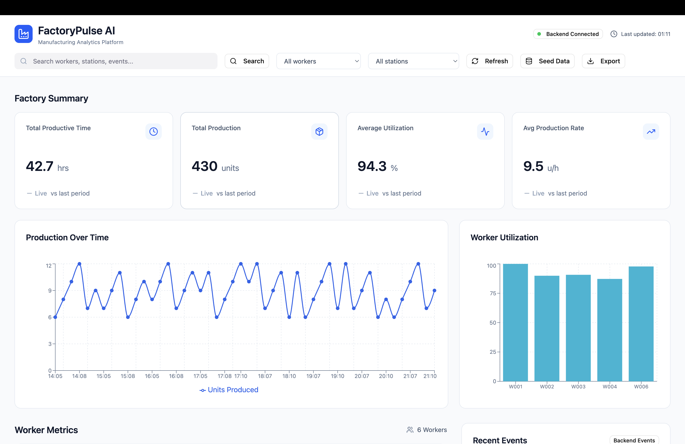
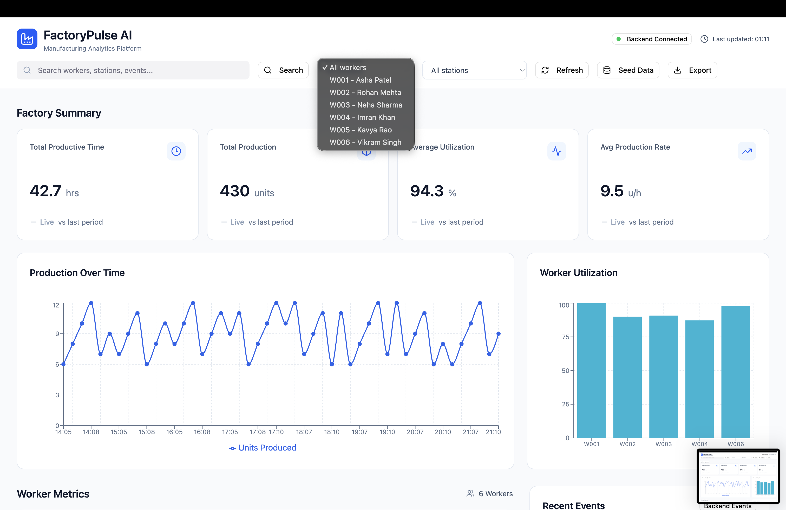
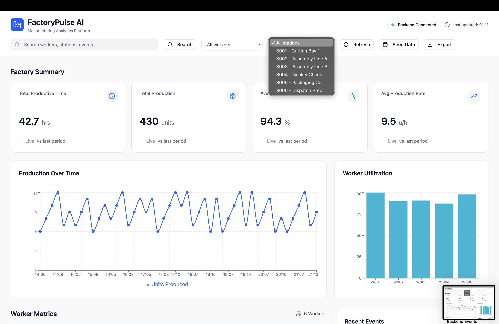
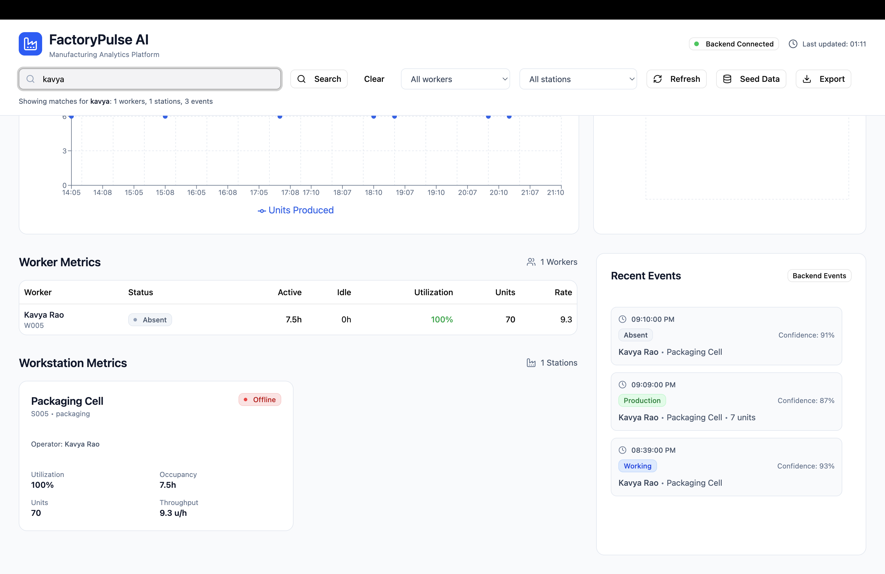
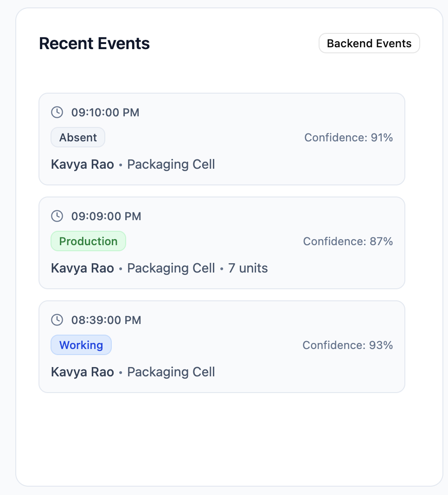
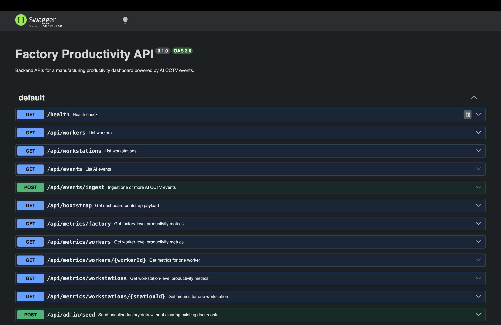
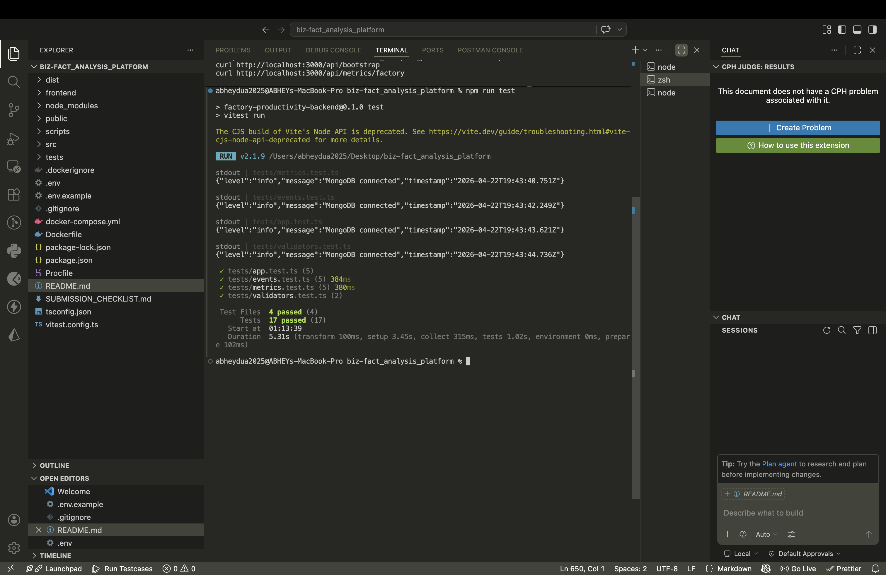
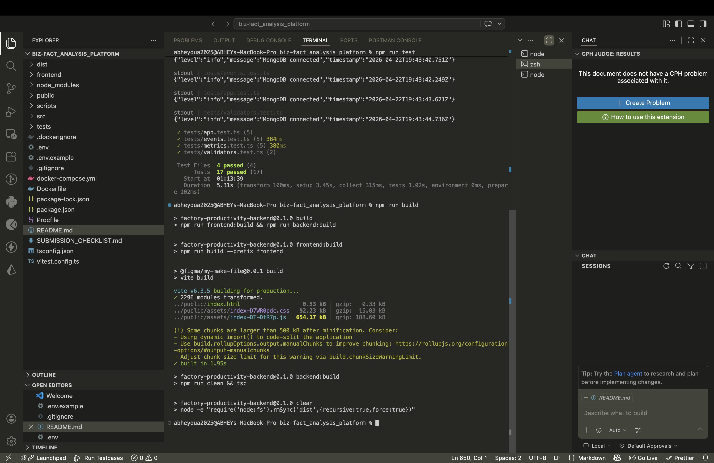
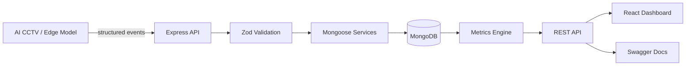
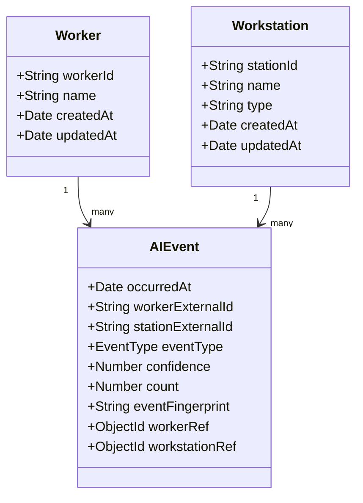

# FactoryPulse AI - Manufacturing Productivity Dashboard

FactoryPulse AI is a full-stack manufacturing productivity dashboard for AI-powered CCTV events. Edge/computer-vision systems emit structured events such as `working`, `idle`, `absent`, and `product_count`; this app ingests them, stores them in MongoDB, deduplicates retries, computes productivity metrics, and exposes both REST APIs and a React dashboard.

The backend is the source of truth. The frontend consumes live backend APIs for factory, worker, workstation, and event data.

## Features

- Single and batch event ingestion with Zod validation.
- MongoDB persistence through Mongoose models.
- Duplicate-event protection through deterministic event fingerprints.
- Worker, workstation, and factory-level metrics.
- Timestamp-based calculations that tolerate out-of-order event arrival.
- Seed/reset utilities with 6 workers, 6 workstations, and realistic shift events.
- Swagger/OpenAPI docs at `/docs`.
- React dashboard served by Express at `/`.
- Tests for validation, ingestion, duplicates, out-of-order events, and metrics.

## Product Tour

### Dashboard



### Worker and Workstation Filters





### Search and Recent Events





### API Docs and Verification







## Architecture





## Tech Stack

- Node.js, TypeScript, Express
- MongoDB, Mongoose
- Zod
- Swagger/OpenAPI
- React + Vite
- Recharts
- Vitest, Supertest, `mongodb-memory-server`
- Docker and Docker Compose support

## Project Structure

```text
src/
  app.ts, server.ts
  config/
  controllers/
  docs/
  lib/
  models/
  routes/
  services/
  validators/

frontend/
  src/app/App.tsx
  src/app/services/api.ts
  src/app/components/

scripts/
  seed.ts
  seed-if-empty.ts

tests/
docs/screenshots/
```

Key files:

- `src/services/event.service.ts`: ingestion, validation orchestration, duplicate handling, event listing.
- `src/services/metrics.service.ts`: worker, workstation, and factory metric calculations.
- `src/services/seedData.ts`: deterministic factory seed dataset.
- `frontend/src/app/services/api.ts`: central frontend API client.
- `src/docs/openapi.ts`: Swagger/OpenAPI document.

## Data Model and Duplicate Strategy

Collections:

- `Worker`: `workerId`, `name`, timestamps.
- `Workstation`: `stationId`, `name`, `type`, timestamps.
- `AIEvent`: event timestamp, worker/station IDs, event type, confidence, count, references, and fingerprint.

Duplicate protection uses a deterministic fingerprint:

```text
normalized timestamp | worker_id | workstation_id | event_type | count
```

This prevents retry submissions from double-counting production. `confidence` is excluded because the same source event may be resent with a slightly different confidence score.

## Metric Rules

All duration calculations use event timestamps, not insertion order.

- `working`, `idle`, and `absent` are state transitions.
- A state starts at its timestamp and lasts until the next state event for the same worker/workstation grouping.
- `product_count` events are production increments. They affect totals/rates but do not create active time.
- A final open state interval closes at the explicit `to` query parameter when provided; otherwise it closes at the max event timestamp in the filtered dataset.

Definitions:

- Worker active time: time in `working`.
- Worker idle time: time in `idle`.
- Worker utilization: `active_time_seconds / tracked_time_seconds * 100`.
- Workstation occupancy: `working` time associated with that station.
- Workstation throughput: `total_units_produced / tracked_hours`.
- Factory productive time: sum of worker active time.
- Factory production count: sum of all production counts.

## API Overview

Swagger UI:

```text
GET /docs/
```

Core endpoints:

| Method | Endpoint | Purpose |
| --- | --- | --- |
| `GET` | `/` | Dashboard |
| `GET` | `/health` | Health check |
| `GET` | `/api/bootstrap` | Workers, workstations, and factory summary |
| `GET` | `/api/workers` | List workers |
| `GET` | `/api/workstations` | List workstations |
| `POST` | `/api/events/ingest` | Ingest one event or a batch |
| `GET` | `/api/events` | List persisted events |
| `GET` | `/api/metrics/factory` | Factory metrics |
| `GET` | `/api/metrics/workers` | All worker metrics |
| `GET` | `/api/metrics/workers/:workerId` | One worker's metrics |
| `GET` | `/api/metrics/workstations` | All workstation metrics |
| `GET` | `/api/metrics/workstations/:stationId` | One workstation's metrics |
| `POST` | `/api/admin/seed` | Upsert seed data |
| `POST` | `/api/admin/reset-and-seed` | Reset and recreate seed data |
| `DELETE` | `/api/admin/events` | Delete events for testing |

Supported filters where relevant: `from`, `to`, `worker_id`, `workstation_id`, `event_type`, `limit`.

## Setup

Create environment file:

```bash
cp .env.example .env
```

Required/manual values:

```env
MONGODB_URI=<your MongoDB URI>
PORT=3000
NODE_ENV=development
CORS_ORIGIN=*
```

Keep real credentials in `.env`, not `.env.example`.

Install, seed, and run:

```bash
npm install
npm run frontend:install
npm run seed
npm run build
npm run dev
```

Open:

- Dashboard: http://localhost:3000/
- Swagger: http://localhost:3000/docs/
- Health: http://localhost:3000/health

Frontend hot reload:

```bash
npm run dev:backend
npm run dev:frontend
```

## Build and Test

```bash
npm run build
npm run test
```

Current verification:

- Build passes.
- Tests pass: 4 files, 17 tests.
- Docker files are included, but Docker was not installed on the development machine for local verification.

## Docker

If Docker is installed:

```bash
docker compose up --build
```

This starts the API and a MongoDB container with a persistent volume.

Reset Docker data:

```bash
docker compose down -v
docker compose up --build
```

## Deployment

The app can deploy as a single Node service. Express serves the compiled React frontend from `public/` and the API from the same origin.

Build command:

```bash
npm install && npm run frontend:install && npm run build
```

Start command:

```bash
npm run deploy:start
```

Deployment env vars:

```env
MONGODB_URI=<MongoDB Atlas or managed MongoDB URI>
PORT=3000
NODE_ENV=production
CORS_ORIGIN=*
```

`deploy:start` seeds only if the database is empty/incomplete, then starts the server.

## Example Requests

```bash
curl http://localhost:3000/health
curl http://localhost:3000/api/bootstrap
curl http://localhost:3000/api/metrics/factory
curl "http://localhost:3000/api/metrics/workers/W001"
curl "http://localhost:3000/api/events?worker_id=W001&limit=10"
```

Ingest one event:

```bash
curl -X POST http://localhost:3000/api/events/ingest \
  -H "Content-Type: application/json" \
  -d '{
    "timestamp": "2026-04-21T10:30:00.000Z",
    "worker_id": "W001",
    "workstation_id": "S001",
    "event_type": "product_count",
    "confidence": 0.94,
    "count": 12
  }'
```

## Real-World Handling

- Intermittent connectivity: delayed batches are accepted; late timestamps are not rejected.
- Duplicate events: deterministic fingerprints prevent double-counting.
- Out-of-order timestamps: events are stored as received, but metrics sort by `occurredAt`.

## Extension Notes

- Model versioning: add `model_version`, `camera_id`, `site_id`, and optional `pipeline_version` to events.
- Drift detection: monitor confidence distributions, event rates, production mismatches, and camera/model anomalies.
- Retraining: trigger from drift alerts, manual audit failures, layout changes, new product types, or confidence degradation.
- Scaling: add queue-backed ingestion, site/camera partitioning, precomputed aggregates, and site-aware authorization.

## Tradeoffs

- No authentication or authorization.
- No queue/streaming layer.
- No background aggregation jobs.
- No model registry implementation.
- Metrics are computed directly from persisted events for clarity in this assessment.
